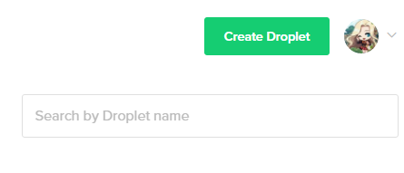
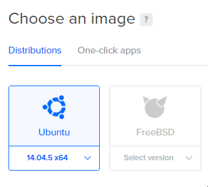
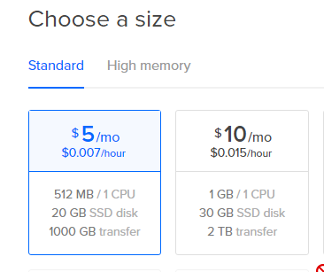
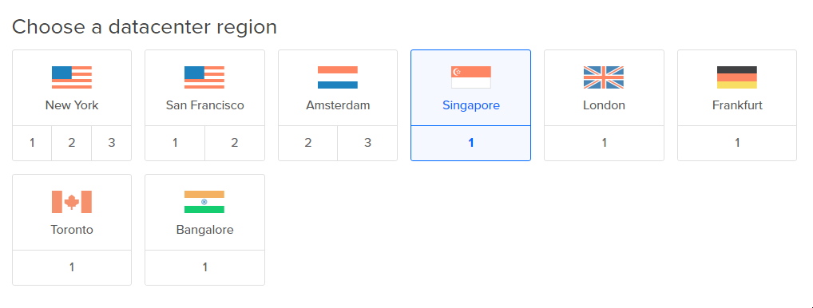
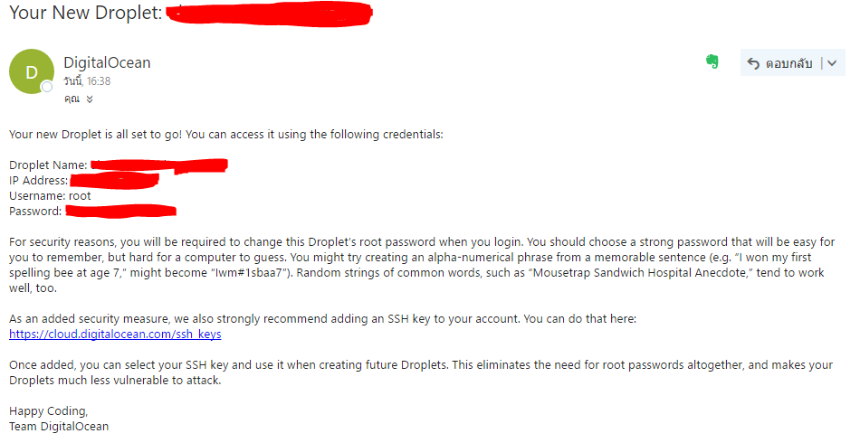
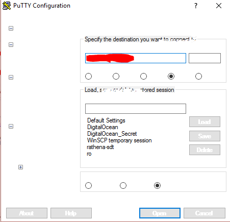

https://github.com/caminkunick/rathena.git# How to create a ready-to-play Ragnarok Online server for as low as low as $5 per month in 30 minutes!

How to create a ready-to-play Ragnarok Online server for as low as low as $5 per month in 30 minutes!

Greetings, Secret here! Here’s my quick way to build a functional Ragnarok Online server on DigitalOcean cloud with the cost as low as $0.007/hour ($5/month).

First, we are going to sign up on DigitalOcean. By clicking my link, you will get free $10 credits. After that, you will have to pay $5 or $10 more initially for the first time only. At this point, there should be $15 or $20 in your credit balance. That’s enough for 3–4 months of running a small server!

After you have done the process of signing up, you can now create a new “droplet” to run your Ragnarok Online server on by clicking the green “New Droplet” button.

<br>



After clicking the Create Droplet button, you will now in the Create Droplet page. In this example, I will choose Ubuntu 14.04 as my OS and the cheapest plan ($5/month) for my droplet.




After choosing OS and spec for your droplet, you have to select a physical location for your droplet. Select one near your players for best connectivity.



If you know what you are doing, select any additional option as you want. But you probably won’t need my guide anyways.
Finally, name your droplet and click “Create”.

Wait for a few minutes for DigitalOcean to create your first droplet.
After it’s done, an email will be sent to your email address that you registered with DigitalOcean, it contains a sensitive information that is the root password. Do not leak that email to anyone!



To access your server, you need a SSH client , such as, PuTTY, or the ssh command included with many Linux distros. This example will use PuTTY.
Open up PuTTY and enter your server’s IP that is emailed to you and click Open. Click yes if the program asks you to store the server’s key.



Enter root in the `login as:` field then enter your password. Your password won’t be shown, not even as ***s. After you logged in, you will be forced to change the root password. Change the password to your liking.
We have finished preparing our droplet at this point. Steps after this will be installing rAthena, an open-source MMORPG server.

Before we start, since our RO server will probably consume more RAM than what we have. We will create a swapfile to be able to host the game.

Instructions to run commands after this will be expressed like below.

```
foo bar
```

First, we will allocate some space, in this case, 4GB.

```
fallocate -l 4G /swapfile
```

Second, adjust permission for our swapfile.

```
chmod 600 /swapfile
```

After that, we will tell the system to set up the swap space by running

```
mkswap /swapfile
swapon /swapfile
```

To make the swapfile persistent, edit the following file using nano by running

```
nano /etc/fstab
```

Add the following line at the end of the file

```
/swapfile   none    swap    sw    0   0
```

Save and close the file by pressing Ctrl+X and Y after that.

We should update our apt sources. We can do that by running `apt-get update` command.

```
apt-get update
```

After the process is done. We will install dependencies required for rAthena to compile.

```
apt-get install -y git make gcc libmysqlclient-dev zlib1g-dev libpcre3-dev build-essential mysql-client
```

We need MySQL database to host any data saved by rAthena, so we will install it.

```
apt-get install mysql-server
```

Follow the prompt after executing the command above.

Now we are going to create and import neccessary database stuffs for our MySQL database.

Change YOURROOTPASSWORD to your MySQL root account password.

Change YOURNEWUSERNAME to your new MySQL account name we are going to create.

Change YOURSQLPASSWORD to your new password for a new database user.

```
mysql -u root — password=YOURROOTPASSWORD -e “CREATE DATABASE ragnarok;”
mysql -u root --password=YOURROOTPASSWORD -e "CREATE USER 'YOURNEWUSERNAME'@'localhost' IDENTIFIED BY 'YOURSQLPASSWORD';"
mysql -u root --password=YOURROOTPASSWORD -e "GRANT ALL PRIVILEGES ON ragnarok.* TO 'YOURNEWUSERNAME'@'localhost';"
mysql -u root --password=YOURROOTPASSWORD ragnarok < sql-files/main.sql
mysql -u root --password=YOURROOTPASSWORD ragnarok < sql-files/logs.sql
mysql -u root --password=YOURROOTPASSWORD ragnarok < sql-files/item_cash_db.sql
mysql -u root --password=YOURROOTPASSWORD ragnarok < sql-files/item_cash_db2.sql
mysql -u root --password=YOURROOTPASSWORD ragnarok < sql-files/item_db.sql
mysql -u root --password=YOURROOTPASSWORD ragnarok < sql-files/item_db2.sql
mysql -u root --password=YOURROOTPASSWORD ragnarok < sql-files/item_db_re.sql
mysql -u root --password=YOURROOTPASSWORD ragnarok < sql-files/item_db2_re.sql
mysql -u root --password=YOURROOTPASSWORD ragnarok < sql-files/mob_db.sql
mysql -u root --password=YOURROOTPASSWORD ragnarok < sql-files/mob_db2.sql
mysql -u root --password=YOURROOTPASSWORD ragnarok < sql-files/mob_db_re.sql
mysql -u root --password=YOURROOTPASSWORD ragnarok < sql-files/mob_db2_re.sql
mysql -u root --password=YOURROOTPASSWORD ragnarok < sql-files/mob_skill_db.sql
mysql -u root --password=YOURROOTPASSWORD ragnarok < sql-files/mob_skill_db2.sql
mysql -u root --password=YOURROOTPASSWORD ragnarok < sql-files/mob_skill_db_re.sql
mysql -u root --password=YOURROOTPASSWORD ragnarok < sql-files/mob_skill_db2_re.sql
mysql -u root --password=YOURROOTPASSWORD ragnarok < sql-files/roulette_default_data.sql
```

Now our database is ready. Don’t forget to take note of your new username and passwords.

It’s probably not a good idea to run your game server as the root user. So we are going to create a new user to run our game server. We will use rathena as our username.

```
useradd --create-home --shell /bin/bash rathena
```

And set the password for our new user.

```
passwd rathena
```

You can obtain the latest version of rAthena by running the following command.

```
git clone https://github.com/caminkunick/rathena.git ~/rAthena
```

We will change our working directory to directory of the rAthena source we just obtained.

```
cd ~/rAthena
```

Before compiling we hav to set our target packet version and generate neccessary files by running the configure script. The format for packetver is YYYYMMDD. We will use 2013–08–07 client in our example.

```
./configure --enable-packetver=20130807
```

To compile, just run make clean and make server command

```
make clean && make server
```

Remember the MySQL user we have created before? We want to make rAthena use that user to connect to MySQL. Type the following command in your shell.

```
nano conf/import/inter_conf.txt
```

Copy the following texts there and press Ctrl+X then type Y to save and exit.

```
sql.db_username: ragnarok
sql.db_password: your password

login_server_id: ragnarok
login_server_pw: your password

ipban_db_id: ragnarok
ipban_db_pw: your password

char_server_id: ragnarok
char_server_pw: your password

map_server_id: ragnarok
map_server_pw: your password

log_db_pw: ragnarok
log_db_db: your password
```

We are done. To run your server. Type the following command.

```
chmod a+x login-server && chmod a+x char-server && chmod a+x map-server && chmod a+x athena-start
```

and

```
./athena-start start
```

That’s all! Now you will need a client to connect to your server which will be explained in the next blog post.

<br>

My DigitalOcean referal link: [Link](https://m.do.co/c/625dc43ce516)

Source from: [Medium.com/@Secrett](https://medium.com/@Secrett/how-to-create-a-ready-to-play-ragnarok-online-server-for-as-low-as-low-as-5-per-month-in-30-c59595838021)
